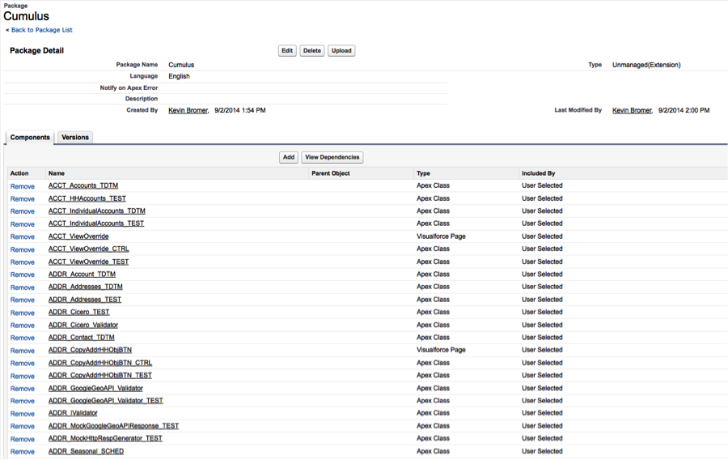

# [Home](http://developer.salesforcefoundation.org/Cumulus/Contributor/) > Create a DE Org

Now that you're done [setting up GitHub](Github.html), each developer for NPSP needs their own development environment where all their coding takes place. Developer edition Salesforce instances (aka ‘DE orgs’) are free, and you can [sign up for one here](https://developer.salesforce.com/en/signup). We strongly recommend starting with a new developer instance to avoid any potential conflicts.

Be sure to write down your login and remember your password. 

# [Set up CumulusCI 2](http://cumulusci.readthedocs.io/en/latest/tutorial.html)

CumulusCI is a command line tool belt and set of reusable Python classes useful in the development and release process of building a Salesforce Managed Package application. CumulusCI was originally built for the development and deployment of the NPSP, and is maintained by Salesforce.org. Among other things, CumulusCI makes the process of setting up a dev org for NPSP development *really* easy -- once you have CumulusCI itself set up. [Follow the tuturial](http://cumulusci.readthedocs.io/en/latest/tutorial.html) to do the following:

1. Install any prerequisites and CumulusCI
2. Set CUMULUSCI_KEY environment variable
3. **Skip** Project Initialization steps - the cloned repo is already set up for CumulusCI
4. Create Connected App
5. Connect the Developer Edition org you created in and set as default.
6. Run the ```dev_org``` CCI flow
    - ```cci flow run dev_org```
7. Run the ```update_admin_profile``` CCI task to grant object and FLS permissions
	- ```cci task run update_admin_profile```
7. Run the ```test_data_dev_org``` flow to get some NPSP test data in there (optional but recommended)
    - ```cci flow run test_data_dev_org```

The ```dev_org``` flow will take a little while, because it goes through a number of steps to deploy the Success Pack most efficiently into your org. There are a number of other tasks and flows included with CumulusCI - you can read about them in its documentation.

At this point, we’ve got some heavy lifting to do here, so its going to take a little bit.  (15 minutes or so) While you’re waiting, here’s a quick explanation of what this is actually doing.

1. Creates the "Cumulus" unmanaged package in your org. 
2. Deploys dependent packages – the most up-to-date versions of Contacts & Organizations, Households, Recurring Donations, Relationships and Affiliations from the NPSP. These are all required for the NPSP code to function properly.
3. Deploys some metadata that's not part of the Cumulus package. Things like record types, business processes, etc.  Standard stuff that’s not managed, but makes the org operate as expected.
4. Deploys the NPSP metadata from your local repository we created in the earlier steps.
5. Deletes any metadata that's in the package in your org, but isn't in your local repository. This won't do anything on your intial deployment, but is useful in the future when you have changed the code.
6. Deploys some more metadata that's not in the package, but is also required for the NPSP code to function properly.
7. Deletes some of the default metadata that comes with your dev org but isn't used in the NPSP.
8. Deploys some metadata useful for working in a new dev org, including System Administrator profile changes and some action overrides.


# Verify Everything Is Added To The Cumulus Package

Back in your DE Org, navigate to Setup > Create > Packages. You should have an unmanaged package named Cumulus. We use this Cumulus package in our build scripts to more easily track what belongs to the NPSP package, and to move metadata around through various processes.



Depending on what you’re doing, you may want to review the org and the [post-install instructions](https://powerofus.force.com/articles/Resource/NPSP-Post-Install-Checklist). The CumulusCI tasks take care of a lot, but not everything. 

# Yay!

Great work. Now comes a choice: do you want to use the [Force.com IDE](Force.com-IDE-Setup.html) or would you rather use [an IDE of your own choosing](Alternate-IDEs.html)?
