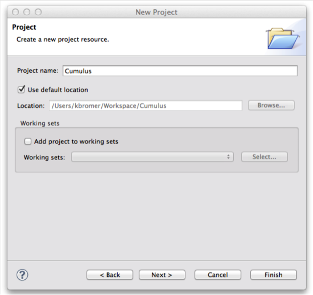
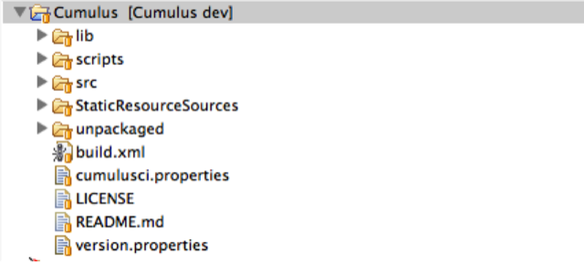
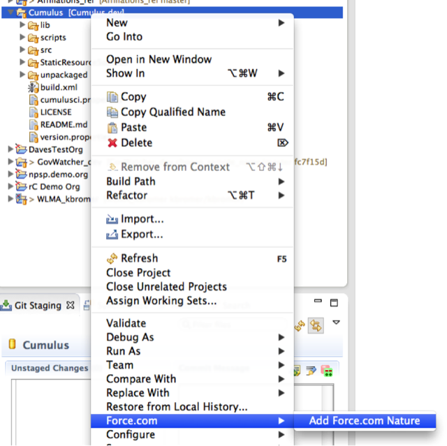
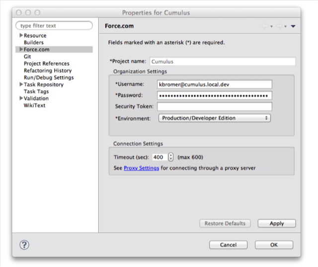
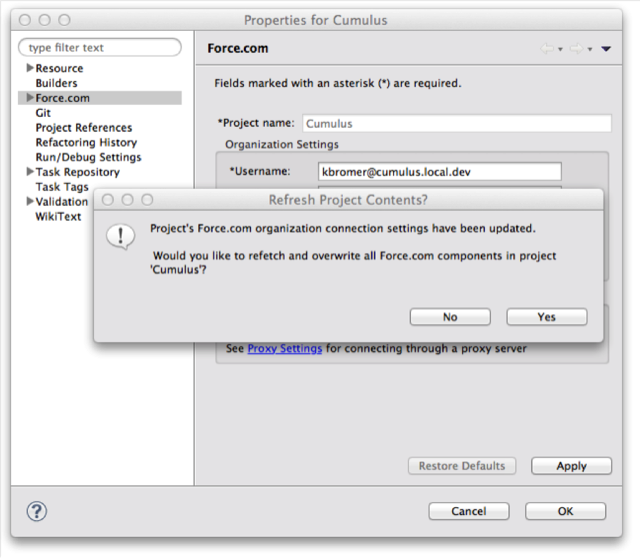

# [Home](http://developer.salesforcefoundation.org/Cumulus/Contributor/) > Setup the Project in the Force.com IDE

If you haven’t done so already, install the Force.com IDE for Eclipse. [Here are instructions on setting up the Force.com IDE up from scratch.](https://developer.salesforce.com/docs/atlas.en-us.eclipse.meta/eclipse/ide_install.htm)

In the Force.com IDE, you want to uncheck ‘Build Automatically’ under ‘Project’.   We don’t want the IDE to start sending random pieces of metadata up to the cloud until we’ve configured everything properly.

Setup a new project in Eclipse.  Right click in the project pane and go to ‘New’ and ‘Project’.  

Enter a new project name.  

If your Eclipse workspace is pointed at the same location as your local git repo, you’ll be good to go.  Otherwise you may need to add version control to your project.  Its under Team -> Share Project, then ‘git’, select an existing repository.  Once you’re ready to roll, it should look something like this:

Now that we’ve configured our DE org and source control repositories, lets get our IDE setup to do some actual coding work.  Back over in Eclipse, right click on the project name and select ‘Add Force.com Nature’. Now’s a good time to double-check that the ‘Build Automatically’ setting is disabled in your org.

After entering the credentials for your DE org, click apply, but make sure that you click ‘No’ when asked if you want to fetch and overwrite anything.  While the code should be pretty much identical, there are enough subtle differences (think about white spacing, order of unordered elements, etc.) to cause git to see differences when there are in fact none.

Now you can finally go back into your IDE and turn back on the Build Automatically setting.  Your Force.com IDE should now be fully configured to do some actual coding on the Nonprofit Success Pack codebase!

# Hooray!

You're all done and ready to [do the work!](Do-the-Work.html)
