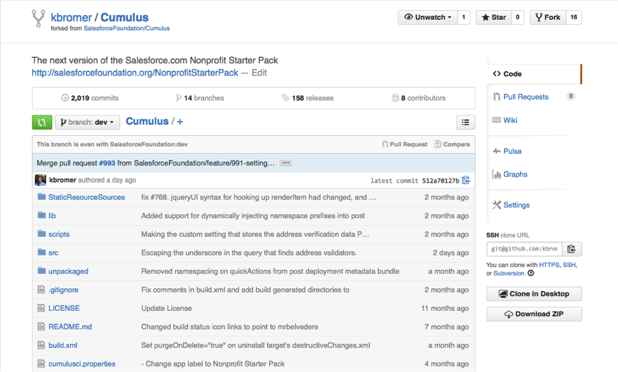
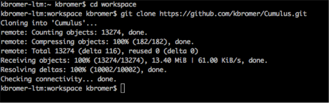

# [Home](http://developer.salesforcefoundation.org/Cumulus/Contributor/) > Github
The Nonprofit Success Pack’s source code is hosted on Github, and you’ll need a github account to contribute to NPSP. If you don’t have an account, [create one first](https://github.com/join).

Next, we need to fork the latest NPSP code and create our own repository.  Login to Github and head to the [Cumulus github repository](https://github.com/SalesforceFoundation/Cumulus). In the upper right hand corner, you’ll see the ‘Fork’ button.  Click it.   Create your fork.  It should look something like this:



Since this is our own copy of the repository, we can modify this as much as we’d like without affecting anything else in the main repo.

# Setting up SSH 

SSH is a security protocol, similar to HTTPS used primarily by web browsers. Setting up SSH for your GitHub account will make the process of pulling and pushing metadata between your computer and GitHub a lot smoother. Especially when there are large files involved, like some of the Static Resources. Rather than go through the details here, we'll refer you to [GitHub's excellent documentation](https://help.github.com/articles/connecting-to-github-with-ssh/) of the topic. The GitHub repository URLs in this documentation assume use of SSH. If you are using HTTPS instead, your ```git clone``` commands will use ```https://github.com/``` instead of ```git@github.com:```.  

# Get the NPSP code onto your computer

Now, lets pull the repo down into a local repository on our machine using git clone.  At the command lane change into the directory where you want your code to live, then run:

~~~
git clone git@github.com:<user_name>/Cumulus.git
~~~

### Cloning…



# Woot!

Congratulations, you are all set up with github! The next step is to create your free [Salesforce Developer Edition instance](Developer-Edition-Salesforce-Instance.html).
