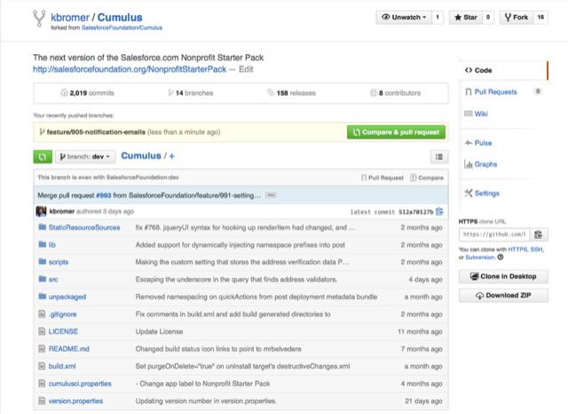
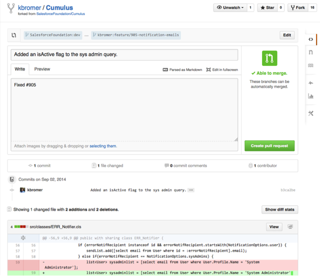
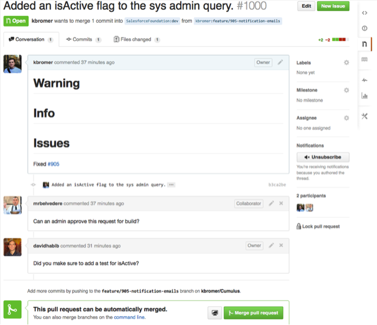
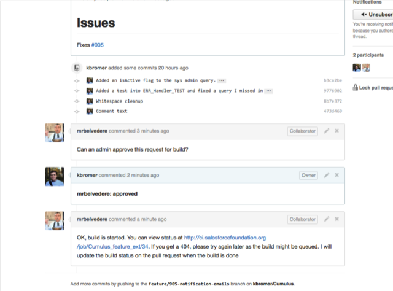
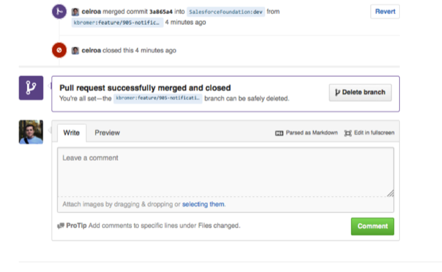

# [Home](http://developer.salesforcefoundation.org/Cumulus/Contributor/) > Submit Your Feature

Now that our feature is complete, we need to commit our code to git. To pull the changes from your dev org to your local git repository, including any new metadata added to the Cumulus unmanaged package, type these commands in your root git repository:

~~~
ant retrievePackagedToSrc
ant updatePackageXml
~~~

Now we can verify our changes are correct by viewing changes in git, with commands like

~~~
git status
git diff
~~~

Once we’re certain that everything is included and all changes make sense, we can commit them and push the changes to the remote github repository:

~~~
git commit -am “Fixing #905 and some more explanatory information.”
git push
~~~



# Create a Pull Request



When you create a pull request, you will see the project's pull request template, with sections labeled Critical Changes, Changes, and Issues. The NPSP automated build processes add these to release notes.

~~~
# Critical Changes
# Changes
# Issues Closed
Fixed #905
~~~

The purpose of the Critical Changes section is to highlight changes that all users need to be aware of on upgrade.  These are generally rare.  The Changes section should contain anything that the users should act on.  For example, if a new field was added, let the users know the field is added and they should grant permissions in profiles and add to layouts to use it. The Issues Closed section should list any GitHUb issues closed - just the number with a preceding pound sign (so that it gets linked to the issue automatically): ```#123``` 



At this point we’ll review your pull request. We may come back to you with changes, in which case you can push updates to the same github branch and they’ll be automatically included in the pull request.

Once everything is hunkey dorey, we’ll approve your pull request and your changes will officially be part of NPSP! Congratulations!



